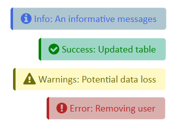
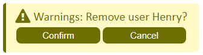
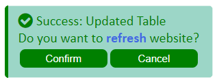

# ahNotification.js
[](../../)
[](ahNotification.min.js)
[](https://ahnotification.js.org)
[](LICENSE)


ahNotification.js is a javascript library that provides simple, lightweight, stylish, responsive and functional/interactable notifications.

<table border="0" align="center">
  <tr>
    <td><b>4 Different Types</b></td>
    <td><b>Custom Interactable Button</b></td>
    <td><b>Support CSS/HTML Tag</b></td>
  </tr>
  <tr>
    <td></td>
    <td></td>
    <td></td>
  </tr>
</table>

## Table of Contents
- [How to Install](#how-to-install)
- [How to Use](#how-to-use)
- [Demo](#demo)
- [Copyright and License](#copyright-and-license)

## How to Install
**Important!** Put this inside body element.
```js
<script id="ahNotification" src="https://rawcdn.githack.com/ahmadhayyan/ahnotification.js/v1.0.0/ahNotification.min.js" integrity="sha384-YN4GV5ZWZ9ZuLdXVbZhdCT8AIyx9NBuYNn0taXRTZ1A03fnx+ZSt7SE46GPgihNq" crossorigin="anonymous"></script>
```
Or download [here](https://github.com/ahmadhayyan/ahnotification.js/releases/download/v1.0.0/ahNotification.min.js), but don't forget to add the `id` when you import the script.

## How to Use
```js
popupNotification(type, text, button, function);
```
- **type** (`string`) = "Info", "Success", "Warnings", "Error".
- **text** (`string`) is any information you want to show the user.
- **button** (`boolean`) = true, false.
- **function** (`string`) is a function you want to run when user click confirm on the button.

### Examples
```js
popupNotification("Info", "An informative messages");
```
```js
popupNotification("Warnings", "Remove user Henry?", true, "removeUser('Henry')");
```

## Demo
Check out the demo at [ahnotification.js.org](https://ahnotification.js.org)

## Copyright and License
Copyright © [Ahmad Hayyan](https://ahmadhayyan.github.io). ahNotification.js is released under the [MIT License](LICENSE).
